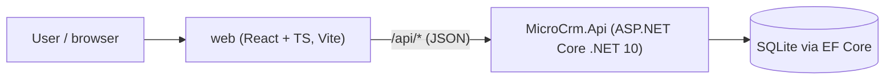

# Architecture: MicroCRM

> Living description of the system **as it is**. Maintained by the planner (/plan) and documenter (/document).

**Last updated:** (bootstrap)

## Overview
MicroCRM lets a user manage **contacts** and **to-dos** (optionally linked to a contact). A React single-page app talks to an ASP.NET Core REST API backed by SQLite.

## Context

In development, Vite serves the SPA and proxies `/api` to the API on `http://localhost:5080`. Deployment topology is not decided yet (see roadmap).

## Components / modules
| Module | Path | Responsibility | Status |
|---|---|---|---|
| API host | `src/MicroCrm.Api/Program.cs` | Composition root, middleware, OpenAPI | scaffolded |
| Contacts feature | `src/MicroCrm.Api/Features/Contacts/` | Contact CRUD endpoints | planned (spec 001–002) |
| Todos feature | `src/MicroCrm.Api/Features/Todos/` | To-do endpoints, contact link | planned (spec 003) |
| Data | `src/MicroCrm.Api/Data/` | EF Core DbContext, migrations | planned |
| Web API client | `web/src/api/` | Typed fetch wrapper + DTO types | planned |
| Web features | `web/src/features/*` | Pages, forms, query hooks | planned (spec 004+) |

## Data model
To be defined by specs. Expected entities: `Contact`, `Todo` (with optional `ContactId`).

## Key flows
To be added as features land.

## Cross-cutting concerns
- **Errors:** ProblemDetails everywhere (API); `api/client.ts` converts them to typed errors (web).
- **Validation:** DataAnnotations + built-in minimal API validation (API); inline form validation mirroring API rules (web). The API is the source of truth.
- **Time:** `TimeProvider` injected; all timestamps UTC.
- **Auth:** none in v1 (single-user, local). Revisit before any deployment.

## Testing strategy
| Layer | Framework | Location | What it covers |
|---|---|---|---|
| API integration | xUnit v3 + WebApplicationFactory + SQLite in-memory | `tests/MicroCrm.Api.Tests/Integration/` | HTTP contract per AC: status, headers, body, persistence |
| API unit | xUnit v3 | `tests/MicroCrm.Api.Tests/Unit/` | Pure domain rules |
| Web component | Vitest + Testing Library + MSW | `web/src/**/*.test.tsx` | UI behavior per AC against mocked API |
| End-to-end | (later) Playwright | `web/e2e/` | A few critical journeys across both tiers |

## Known risks & tech debt
- Frontend DTO types are hand-written and can drift from the API. Mitigation: reviewer checks both sides for API tasks; consider OpenAPI type generation later (ADR).

## Decisions
See `docs/adr/`, especially ADR-0002.
