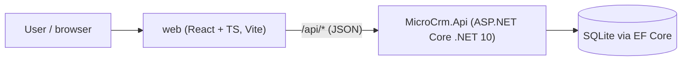

# Architecture: MicroCRM

> Living description of the system **as it is**. Maintained by the planner (/plan) and documenter (/document).

**Last updated:** 2026-10-05 (spec 003)

## Overview
MicroCRM lets a user manage **contacts** and **to-dos** (optionally linked to a contact). A React single-page app talks to an ASP.NET Core REST API backed by SQLite.

## Context

In development, Vite serves the SPA and proxies `/api` to the API on `http://localhost:5080`. Deployment topology is not decided yet (see roadmap).

## Components / modules
| Module | Path | Responsibility | Status |
|---|---|---|---|
| API host | `src/MicroCrm.Api/Program.cs` | Composition root: services, error pipeline, migrate at startup, OpenAPI (Development), `MapContactsEndpoints()`, `MapTodosEndpoints()`; forces `Foreign Keys=True` on the connection string | built |
| Contacts feature | `src/MicroCrm.Api/Features/Contacts/` | `Contact` entity, `ContactDtos`, `ContactInput` (trim + validate), `ContactsEndpoints` (create, get by id, list with paging and search, update, delete) | built (spec 001, 002) |
| Todos feature | `src/MicroCrm.Api/Features/Todos/` | `Todo` entity (`Complete`/`Reopen` rules), `TodoDtos`, `TodoInput` (trim + validate), `TodoListQuery` (paging, `status`, `contactId`), `TodosEndpoints` (create, get by id, list, update, delete, complete, reopen, and `GET /api/contacts/{id}/todos`) | built (spec 003) |
| Data | `src/MicroCrm.Api/Data/` | `AppDbContext`, `ContactConfiguration` (NOCASE collations, unique `Email` index), `TodoConfiguration` (tick converters, FK `ON DELETE SET NULL`, indexes, `CK_Todos_DoneState`), `SqliteErrors` (unique-violation 2067 and foreign-key-violation 787 checks), `Migrations/` | built |
| Common | `src/MicroCrm.Api/Common/` | `Paging.cs` (`ListQuery.Parse`, `PagedResponse<T>`), `LikePattern` (escape for `LIKE ... ESCAPE '\'`), `TextNormalization.TrimToNull` | built |
| Web API client | `web/src/api/` | Typed fetch wrapper + DTO types | planned |
| Web features | `web/src/features/*` | Pages, forms, query hooks | planned (spec 004+) |

### Error pipeline (Program.cs, all environments)
`AddProblemDetails()` -> `UseExceptionHandler()` -> `UseStatusCodePages()`, with `RouteHandlerOptions.ThrowOnBadRequest = false`.
- Unhandled exceptions become a 500 problem+json with no exception details.
- Empty 4xx/5xx responses (unmatched route, `NotFound`, body-binding 400, 405, 415) are turned into problem+json by status code pages.
- Field validation uses `TypedResults.ValidationProblem` (400 with `errors`); duplicate email uses `TypedResults.Problem(409)`.
See ADR-0004.

### Persistence
SQLite via EF Core; connection string `ConnectionStrings:MicroCrm` (`Data Source=microcrm.db`). Migrations (`CreateContacts`, `AddContactEmailUniqueIndex`, `AddContactNameCollation`, `CreateTodos`) are applied at startup with `Database.MigrateAsync()`. Revisit before any deployment. Text matching, uniqueness and ordering are case-insensitive for ASCII only (ADR-0003). `Program.cs` builds the connection string with `SqliteConnectionStringBuilder { ForeignKeys = true }`, so every connection enforces foreign keys whatever the configuration or native SQLite build says (ADR-0008).

## Data model
**Contact** (table `Contacts`)

| Column | Type | Notes |
|---|---|---|
| `Id` | Guid (v7) | primary key, assigned by the API |
| `FirstName` | text, required | NOCASE collation |
| `LastName` | text, null | NOCASE collation |
| `Email` | text, null | NOCASE collation, unique index `IX_Contacts_Email` (many NULLs allowed) |
| `Phone`, `Company`, `Notes` | text, null | free text |
| `CreatedAt`, `UpdatedAt` | DateTimeOffset (UTC) | from `TimeProvider`; equal on creation |

Max lengths (100/100/254/50/200/4000) are enforced in `ContactInput`, not in the database.

**Todo** (table `Todos`, migration `CreateTodos`)

| Column | Type | Notes |
|---|---|---|
| `Id` | Guid (v7) | primary key, assigned by the API |
| `Title` | text, required | max 200, enforced in `TodoInput` |
| `Notes` | text, null | max 4000, enforced in `TodoInput` |
| `DueDate` | `DateOnly`, null | `TEXT` `yyyy-MM-dd`; sorts as text (ADR-0007) |
| `ContactId` | Guid, null | FK `FK_Todos_Contacts_ContactId` to `Contacts(Id)`, **`ON DELETE SET NULL`**; index `IX_Todos_ContactId` |
| `IsDone` | bool | `INTEGER`; `CK_Todos_DoneState` makes `IsDone` and `CompletedAt IS NOT NULL` agree |
| `CompletedAt`, `CreatedAt`, `UpdatedAt` | `DateTimeOffset` (UTC), stored as **`INTEGER` UTC ticks** | value converter; `CompletedAt` null while open; `CreatedAt` = `UpdatedAt` on creation (ADR-0009) |

Index `IX_Todos_IsDone_DueDate` (`IsDone`, `DueDate`) exists for the status filters. `Contact` has no navigation property, so contact responses are unchanged. Contact deletion unlinks the contact's to-dos in the database (see flows); the database is the arbiter of "contact exists" for to-do writes.

## Key flows
- **Create:** `ContactInput.Parse` -> insert -> unique-violation (SQLite 2067) maps to 409.
- **Update (`PUT /api/contacts/{id}`, full replace):** body binding (400, plain ProblemDetails) -> `ContactInput.Parse(UpdateContactRequest)` (400 with `errors`; shares one core with create) -> tracked lookup (404) -> assign all six fields, `UpdatedAt = TimeProvider` now -> `SaveChangesAsync`. On save: `DbUpdateConcurrencyException` (deleted in between) -> 404; unique violation (SQLite 2067) -> 409; anything else -> 500 via the exception handler. `id` and `createdAt` never change.
- **Delete (`DELETE /api/contacts/{id}`):** a single `ExecuteDeleteAsync`; 0 rows affected -> 404, otherwise 204. No read-then-delete, so concurrent deletes give exactly one 204. The FK `ON DELETE SET NULL` runs inside that statement, so removal and unlink are one atomic change on every delete path (spec 002 Decision, ADR-0008); the to-do's other fields, including `updatedAt`, are untouched.
- **List (contacts):** `ListQuery.Parse` -> filter (escaped `LIKE` on first name, last name, email) -> count -> order (last name nulls last, first name, id) -> skip/take.
- **Create to-do (`POST /api/todos`):** `TodoInput.Parse` (400 with `errors`; `dueDate` is parsed as a string with `DateOnly.TryParseExact("yyyy-MM-dd")`) -> insert with `isDone = false` -> `SaveChangesAsync`. There is **no contact pre-check**: a `DbUpdateException` whose inner `SqliteException` has extended code **787** maps to 400 `contactId: ["Must refer to an existing contact."]`, including when the contact is deleted concurrently. Other constraint failures stay 500. Field errors win: an unknown contact is reported only when every field rule passes.
- **Update to-do (`PUT /api/todos/{id}`, full replace):** body binding (400) -> `TodoInput.Parse` (400) -> tracked lookup (404) -> assign the four editable fields and `UpdatedAt` -> mark `ContactId` modified (so the FK is re-checked even if unchanged) -> save. `DbUpdateConcurrencyException` (deleted in between) -> 404 (caught before the 787 check); 787 -> the same `contactId` 400. `id`, `createdAt`, `isDone`, `completedAt` never change.
- **Complete / reopen (`POST /api/todos/{id}/complete|reopen`):** tracked lookup (404) -> `Todo.Complete/Reopen(now)` returns whether anything changed -> save only if it did, so a repeat is a 200 no-op that keeps `completedAt` and `updatedAt`. Deleted in between -> 404. Request bodies are ignored.
- **Delete to-do:** a single `ExecuteDeleteAsync`; 0 rows -> 404, otherwise 204 (no read-then-delete, so concurrent deletes give exactly one 204).
- **Lists (`GET /api/todos`, `GET /api/contacts/{id}/todos`):** `TodoListQuery.Parse` (paging via the shared `ListQuery` rules; `status` trimmed, case-insensitive, one of open/done/overdue; `contactId` a GUID) -> 400 with every offending parameter -> (nested only) contact lookup, 404 if missing -> filter -> `COUNT` -> order by due date (none last), `createdAt`, `id` -> skip/take. `contactId` is ignored on the nested route. A well-formed `contactId` matching no contact gives an empty page on the global list.
- **Status filters:** `open` = `NOT IsDone`, `done` = `IsDone`, `overdue` = open, `DueDate` not null and `DueDate < today`, where *today* is `DateOnly.FromDateTime(TimeProvider.GetUtcNow().UtcDateTime)` computed per request. A to-do due today is not overdue; for users west of UTC a to-do turns overdue in the evening of its due date (ADR-0007).

## Cross-cutting concerns
- **Errors:** ProblemDetails everywhere (API); `api/client.ts` converts them to typed errors (web).
- **Validation:** plain `Parse` functions that trim first (API, ADR-0004); inline form validation mirroring API rules (web). The API is the source of truth.
- **Time:** `TimeProvider` injected; all timestamps UTC. A to-do's `dueDate` is a calendar day (`DateOnly`), not an instant.
- **Auth:** none in v1 (single-user, local). Revisit before any deployment.

## Testing strategy
| Layer | Framework | Location | What it covers |
|---|---|---|---|
| API integration | xUnit v3 + WebApplicationFactory + named shared-cache in-memory SQLite (ADR-0005) | `tests/MicroCrm.Api.Tests/Integration/` | HTTP contract per AC: status, headers, body, persistence |
| API unit | xUnit v3 | `tests/MicroCrm.Api.Tests/Unit/` | Pure rules: `ContactInput`, `TodoInput`, `TodoListQuery`, `Todo`, `ListQuery`, `LikePattern` |
| Web component | Vitest + Testing Library + MSW | `web/src/**/*.test.tsx` | UI behavior per AC against mocked API |
| End-to-end | (later) Playwright | `web/e2e/` | A few critical journeys across both tiers |

## Known risks & tech debt
- **Foreign keys can be switched off outside the API.** AC-066 holds for every connection opened through Microsoft.Data.Sqlite with the bundled native library, because `Program.cs` forces `Foreign Keys=True`. A tool that opens `microcrm.db` with foreign keys off (the `sqlite3` CLI without `PRAGMA foreign_keys = ON`, or a different native SQLite) can delete a contact and leave dangling `ContactId` values, and can insert a dangling link. A connection string with `Foreign Keys=False` in `ConnectionStrings:MicroCrm` is overridden by the API.
- **Migration-rebuild hazard (ADR-0008).** A migration that rebuilds `Contacts` (for example `AlterColumn` on a contact column; SQLite rebuilds the table) runs `DROP TABLE Contacts` inside the migration transaction, where `PRAGMA foreign_keys = 0` is ignored, and the implicit delete fires `ON DELETE SET NULL` on every to-do. Any future spec that alters `Contacts` must first add a test that linked to-dos survive the migration and use a safe technique (hand-written migration that disables foreign keys outside the transaction, or save and restore the links). This is also why `Contacts` timestamps were not moved to ticks (ADR-0009).
- **The 787 mapping assumes one foreign key on `Todos`.** SQLite reports that a foreign key failed, not which one. If `Todos` gains a second FK, the 787 to `contactId` 400 mapping in `TodosEndpoints` must be revisited.
- **Log noise on expected 400/409.** EF Core logs a `fail:` entry with a stack trace (`Microsoft.EntityFrameworkCore.Update`) for every expected unknown-contact 400 and duplicate-email 409. No values are logged (parameters show as `'?'`). Consider filtering that category if it matters.
- The status filters scan `Todos` rather than seek `IX_Todos_IsDone_DueDate`, because EF Core emits `NOT ("IsDone")`; without `ANALYZE` SQLite scans. Measured with 10,000 to-dos the slowest request took 31.5 ms (NFR-003 limit 500 ms), so nothing to do until a measured need.
- Spec 001's `AlterColumn` migrations log an EF Core warning at startup on a fresh database: "PRAGMA foreign_keys = 0 cannot be executed in a transaction". It is harmless for the local SQLite file; ignore it.
- Frontend DTO types are hand-written and can drift from the API. Mitigation: reviewer checks both sides for API tasks; consider OpenAPI type generation later (ADR).

## Decisions
See `docs/adr/`, especially ADR-0002 (stack), ADR-0003 (case-insensitive SQLite), ADR-0004 (validation and errors), ADR-0005 (test database), ADR-0006 (validation message style), ADR-0007 (date-only `dueDate`), ADR-0008 (contact link enforced by a foreign key), ADR-0009 (to-do timestamps as UTC ticks).
