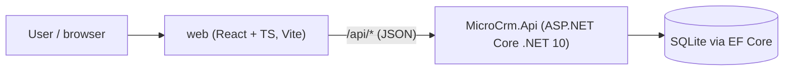

# Architecture: MicroCRM

> Living description of the system **as it is**. Maintained by the planner (/plan) and documenter (/document).

**Last updated:** 2026-10-01 (spec 001)

## Overview
MicroCRM lets a user manage **contacts** and **to-dos** (optionally linked to a contact). A React single-page app talks to an ASP.NET Core REST API backed by SQLite.

## Context

In development, Vite serves the SPA and proxies `/api` to the API on `http://localhost:5080`. Deployment topology is not decided yet (see roadmap).

## Components / modules
| Module | Path | Responsibility | Status |
|---|---|---|---|
| API host | `src/MicroCrm.Api/Program.cs` | Composition root: services, error pipeline, migrate at startup, OpenAPI (Development), `MapContactsEndpoints()` | built |
| Contacts feature | `src/MicroCrm.Api/Features/Contacts/` | `Contact` entity, `ContactDtos`, `ContactInput` (trim + validate), `ContactsEndpoints` (create, get by id, list with paging and search) | built (spec 001); update/delete planned (spec 002) |
| Todos feature | `src/MicroCrm.Api/Features/Todos/` | To-do endpoints, contact link | planned (spec 003) |
| Data | `src/MicroCrm.Api/Data/` | `AppDbContext`, `ContactConfiguration` (NOCASE collations, unique `Email` index), `SqliteErrors` (unique-violation check), `Migrations/` | built |
| Common | `src/MicroCrm.Api/Common/` | `Paging.cs` (`ListQuery.Parse`, `PagedResponse<T>`), `LikePattern` (escape for `LIKE ... ESCAPE '\'`) | built |
| Web API client | `web/src/api/` | Typed fetch wrapper + DTO types | planned |
| Web features | `web/src/features/*` | Pages, forms, query hooks | planned (spec 004+) |

### Error pipeline (Program.cs, all environments)
`AddProblemDetails()` -> `UseExceptionHandler()` -> `UseStatusCodePages()`, with `RouteHandlerOptions.ThrowOnBadRequest = false`.
- Unhandled exceptions become a 500 problem+json with no exception details.
- Empty 4xx/5xx responses (unmatched route, `NotFound`, body-binding 400, 405, 415) are turned into problem+json by status code pages.
- Field validation uses `TypedResults.ValidationProblem` (400 with `errors`); duplicate email uses `TypedResults.Problem(409)`.
See ADR-0004.

### Persistence
SQLite via EF Core; connection string `ConnectionStrings:MicroCrm` (`Data Source=microcrm.db`). Migrations (`CreateContacts`, `AddContactEmailUniqueIndex`, `AddContactNameCollation`) are applied at startup with `Database.MigrateAsync()`. Revisit before any deployment. Text matching, uniqueness and ordering are case-insensitive for ASCII only (ADR-0003).

## Data model
**Contact** (table `Contacts`)

| Column | Type | Notes |
|---|---|---|
| `Id` | Guid (v7) | primary key, assigned by the API |
| `FirstName` | text, required | NOCASE collation |
| `LastName` | text, null | NOCASE collation |
| `Email` | text, null | NOCASE collation, unique index `IX_Contacts_Email` (many NULLs allowed) |
| `Phone`, `Company`, `Notes` | text, null | free text |
| `CreatedAt`, `UpdatedAt` | DateTimeOffset (UTC) | from `TimeProvider`; equal on creation |

Max lengths (100/100/254/50/200/4000) are enforced in `ContactInput`, not in the database. Expected later: `Todo` (with optional `ContactId`).

## Key flows
- **Create:** `ContactInput.Parse` -> insert -> unique-violation (SQLite 2067) maps to 409.
- **List:** `ListQuery.Parse` -> filter (escaped `LIKE` on first name, last name, email) -> count -> order (last name nulls last, first name, id) -> skip/take.

## Cross-cutting concerns
- **Errors:** ProblemDetails everywhere (API); `api/client.ts` converts them to typed errors (web).
- **Validation:** plain `Parse` functions that trim first (API, ADR-0004); inline form validation mirroring API rules (web). The API is the source of truth.
- **Time:** `TimeProvider` injected; all timestamps UTC.
- **Auth:** none in v1 (single-user, local). Revisit before any deployment.

## Testing strategy
| Layer | Framework | Location | What it covers |
|---|---|---|---|
| API integration | xUnit v3 + WebApplicationFactory + named shared-cache in-memory SQLite (ADR-0005) | `tests/MicroCrm.Api.Tests/Integration/` | HTTP contract per AC: status, headers, body, persistence |
| API unit | xUnit v3 | `tests/MicroCrm.Api.Tests/Unit/` | Pure rules: `ContactInput`, `ListQuery`, `LikePattern` |
| Web component | Vitest + Testing Library + MSW | `web/src/**/*.test.tsx` | UI behavior per AC against mocked API |
| End-to-end | (later) Playwright | `web/e2e/` | A few critical journeys across both tiers |

## Known risks & tech debt
- Frontend DTO types are hand-written and can drift from the API. Mitigation: reviewer checks both sides for API tasks; consider OpenAPI type generation later (ADR).

## Decisions
See `docs/adr/`, especially ADR-0002 (stack), ADR-0003 (case-insensitive SQLite), ADR-0004 (validation and errors), ADR-0005 (test database).
