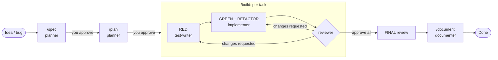

# Harness Guide: Spec-Driven + Test-Driven Multi-Agent Development

This repo uses a Claude Code harness in which five specialized subagents move every change through
**Spec → Plan → Tasks → Red → Green → Refactor → Review → Docs**, with you approving the spec and the plan.

## The loop

## Quick start

**New project**
1. Copy the harness in (see *Install*), fill in the **Project** section of `CLAUDE.md` and the commands in `.claude/harness.env`.
2. Make sure `TEST_CMD` runs and is green (even with zero tests).
3. `/spec <your first feature>` → answer questions → approve → `/plan 001` → approve → `/build 001`.

**Existing project**
1. Install the harness (it won't overwrite existing files).
2. Run `/onboard`. It maps the architecture, detects commands, and baselines the test suite.
3. Fix or acknowledge any red tests. Consider a first spec for characterization tests around risky, untested code.
4. Continue with `/spec` as above.

## Commands
| Command | What it does |
|---|---|
| `/spec <idea>` | Clarify, then draft `specs/NNN-slug/spec.md` with EARS acceptance criteria |
| `/plan <id>` | Technical plan + TDD task list for an approved spec |
| `/build <id> [T-XX]` | Run red → green → refactor → review for each task, then final review + docs |
| `/bugfix <report>` | Regression test first, then fix, review, changelog |
| `/review [id] [T-XX\|FINAL]` | Independent review of a spec/task or of the current diff |
| `/document [id]` | Update docs, CHANGELOG, ADRs |
| `/onboard` | Adopt the harness in an existing repo |
| `/status` | Progress across all specs |

You can also call agents directly: `@"reviewer (agent)" look at the auth changes`.

## Guardrails (what's enforced vs. instructed)
| Guardrail | Mechanism |
|---|---|
| Each agent writes only its own files (e.g. implementer can't touch tests) | `PreToolUse` hook in each agent's frontmatter → `path-guard.sh` + globs in `harness.env` |
| Nobody edits `.env`, keys, `.git/` | Session-wide `PreToolUse` hook + `permissions.deny` |
| Reviewer can't edit code | No Edit tool + write limited to `review.md` |
| Changed files get formatted | `PostToolUse` hook → `FORMAT_CMD` |
| Can't finish a turn with failing tests (opt-in) | `Stop` hook, `STOP_GATE=1` |
| Tests fail first, for the right reason | Orchestrator verifies in `/build` |
| Spec approved before build; AC→test traceability | `/build` preconditions + reviewer checklist |

The path hooks cover the file-editing tools, not shell redirection via Bash. Agents are told not to write files through Bash, and the reviewer checks the diff.

**Workspace trust:** hooks in project subagent frontmatter only run after you accept Claude Code's trust dialog for this folder. Also make the hook scripts executable (`chmod +x .claude/hooks/*.sh`). They use `jq` if present and fall back to `python3`.

## Tuning
- **Models:** planner and reviewer use `opus` (reasoning-heavy); test-writer, implementer, documenter use `sonnet`. Change `model:` in `.claude/agents/*.md`, or use `inherit`.
- **Paths:** edit `SOURCE_GLOBS`, `TEST_GLOBS`, and the `*_WRITABLE` / `*_PROTECTED` lists in `harness.env` to match your layout (monorepos: add `packages/*/…` patterns).
- **Strictness:** `STOP_GATE=1` to block ending a turn on a red suite; `COMMIT_PER_TASK=1` to commit after each approved task.
- **Reviewer memory:** the reviewer keeps project memory in `.claude/agent-memory/reviewer/`. Commit it so recurring findings are shared.
- **Per-developer overrides:** put personal settings in `.claude/settings.local.json` (gitignored).

## Tips
- Keep specs small. If a spec has more than ~8 ACs or ~8 tasks, split it.
- When the implementer reports `BLOCKED` because a test seems wrong, that's the system working: it means the spec or plan needs a decision. Fix the spec, then re-run the task.
- Resume long builds with `/build <id>`; it picks up unchecked tasks from `tasks.md`.
- For a trivial change (typo, dependency bump), skip `/spec`, but still run the tests and `/review`.
